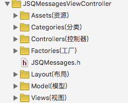

## JSQMS源码简单分析
今天忙里偷闲，简单分析了一下JSQMS源码。由于在项目中用到过，github有超过七千多颗星。想必代码质量应该是杠杠的。

### 一、项目结构
先来看看总体的**项目结构**


个人觉得这目录结构给人的感觉就非常爽，如果虚拟目录和实际目录一一对对应那就更好了。

事实证明确实是一一对应的


如果以前维护过老项目的同学看到这么清爽的目录结构，是不是感觉比老项目好很多。

在这基础上其实个人认为还可以完美一点。也就是对国人iOS开发者而言。可以整理成如下方式：



### 二、源码分析
---
#### JSQMessages.h
比如一个.h文件没什么，其实里面的东西还可以

来看一下里面的**源码**

``` 
#ifndef JSQMessages_JSQMessages_h
#define JSQMessages_JSQMessages_h

//  ViewController
#import "JSQMessagesViewController.h"

//  Views
#import "JSQMessagesCollectionView.h"
#import "JSQMessagesCollectionViewCellIncoming.h"
#import "JSQMessagesCollectionViewCellOutgoing.h"
#import "JSQMessagesTypingIndicatorFooterView.h"
#import "JSQMessagesLoadEarlierHeaderView.h"

//  Layout
#import "JSQMessagesBubbleSizeCalculating.h"
#import "JSQMessagesBubblesSizeCalculator.h"
#import "JSQMessagesCollectionViewFlowLayout.h"
#import "JSQMessagesCollectionViewLayoutAttributes.h"
#import "JSQMessagesCollectionViewFlowLayoutInvalidationContext.h"

//  Toolbar
#import "JSQMessagesComposerTextView.h"
#import "JSQMessagesInputToolbar.h"
#import "JSQMessagesToolbarContentView.h"

//  Model
#import "JSQMessage.h"

#import "JSQMediaItem.h"
#import "JSQPhotoMediaItem.h"
#import "JSQLocationMediaItem.h"
#import "JSQVideoMediaItem.h"

#import "JSQMessagesBubbleImage.h"
#import "JSQMessagesAvatarImage.h"

//  Protocols
#import "JSQMessageData.h"
#import "JSQMessageMediaData.h"
#import "JSQMessageAvatarImageDataSource.h"
#import "JSQMessageBubbleImageDataSource.h"
#import "JSQMessagesCollectionViewDataSource.h"
#import "JSQMessagesCollectionViewDelegateFlowLayout.h"

//  Factories
#import "JSQMessagesAvatarImageFactory.h"
#import "JSQMessagesBubbleImageFactory.h"
#import "JSQMessagesMediaViewBubbleImageMasker.h"
#import "JSQMessagesTimestampFormatter.h"
#import "JSQMessagesToolbarButtonFactory.h"

//  Categories
#import "JSQSystemSoundPlayer+JSQMessages.h"
#import "NSString+JSQMessages.h"
#import "UIColor+JSQMessages.h"
#import "UIImage+JSQMessages.h"
#import "UIView+JSQMessages.h"
#import "NSBundle+JSQMessages.h"

#endif 
```
来提取一点值得学习的东西吧！

> 1. 把项目需要暴露给外部的头文件全部放在一个.h文件里面,便于管理。
> 2. 整个排版，换行和空格的合理使用，(这里面是换一行，不同模块空四个空格)
> 3. 把属于不同模块的.h文件放一起，控制器，视图，分类，协议等等归类。
> 4. 来看看个人觉得比较重要的条件编译，`#ifndef #define #endif`。如果你告诉我说你不知道这里为什么用条件编译。如果自己写过第三方应该就能猜到。举个例子，如果你写了一个很牛逼的第三方A，一家做SDK(暂且叫B)的公司用了你这个库。然后你项目中用到了这个B,恰好你在项目中也使用了A。则会造成重复编译。这只是我的猜测。不对勿喷！
> 5. 还是细节，仔细看每个模块后面都加了个s,表示复数

看完`JSQMessages.h `之后 是不是觉得我们平时写的代码不够优雅呢

#### Models模块
在看完Models这部分，给我感触最大的就是使用了面向接口编程的思想。想文件如下：


其中只有.h的文件就是定义的协议。这些协议规定了一套规则。虽然看起来有点麻烦。但这样再项目后期的维护阶段是百利而无一害的。
具体接口文件有：

``` 
JSQMessageData.h
JSQMessageMediaData.h
JSQMessageAvatarImageDataSource.h
JSQMessageBubbleImageDataSource.h
JSQMessagesCollectionViewDataSource.h
JSQMessagesCollectionViewDelegateFlowLayout.h

```

其实这些接口的作用无非就是进行一些规则的约束
比如`JSQMessageData.h`中,就定义了必须有消息的senderId，date等基本属性。只要是关于消息的类，都需要实现这个协议。也就把经常说的面向对象接口编程。

``` 
@protocol JSQMessageData <NSObject>

@required

/**
 *  @return A string identifier that uniquely identifies the user who sent the message.
 *
 *  @discussion If you need to generate a unique identifier, consider using 
 *  `[[NSProcessInfo processInfo] globallyUniqueString]`
 *
 *  @warning You must not return `nil` from this method. This value must be unique.
 */
- (NSString *)senderId;

/**
 *  @return The display name for the user who sent the message.
 *
 *  @warning You must not return `nil` from this method.
 */
- (NSString *)senderDisplayName;

/**
 *  @return The date that the message was sent.
 *
 *  @warning You must not return `nil` from this method.
 */
- (NSDate *)date;

/**
 *  This method is used to determine if the message data item contains text or media.
 *  If this method returns `YES`, an instance of `JSQMessagesViewController` will ignore 
 *  the `text` method of this protocol when dequeuing a `JSQMessagesCollectionViewCell`
 *  and only call the `media` method. 
 *
 *  Similarly, if this method returns `NO` then the `media` method will be ignored and
 *  and only the `text` method will be called.
 *
 *  @return A boolean value specifying whether or not this is a media message or a text message.
 *  Return `YES` if this item is a media message, and `NO` if it is a text message.
 */
- (BOOL)isMediaMessage;

/**
 *  @return An integer that can be used as a table address in a hash table structure.
 *
 *  @discussion This value must be unique for each message with distinct contents. 
 *  This value is used to cache layout information in the collection view.
 */
- (NSUInteger)messageHash;
```

在这个模块我简单的抽一些有价值的东西
> * 用接口来约定实现哪些属性。getter，比如：
> ` - (NSString *)senderId;`
> * 如果子类没有实现父类约定的属性，报出异常。如下
> 
> ```- (UIView *)mediaView
{
    NSAssert(NO, @"Error! required method not implemented in subclass. Need to implement %s", __PRETTY_FUNCTION__);
    return nil;
}
```
> * 根据has标识一个类
> 
> ```- (NSUInteger)hash
{
    return [NSNumber numberWithBool:self.appliesMediaViewMaskAsOutgoing].hash;
}
```
> * 归档的写法
> 
> ```
- (instancetype)initWithCoder:(NSCoder *)aDecoder
{
    self = [super init];
    if (self) {
        _appliesMediaViewMaskAsOutgoing = [aDecoder decodeBoolForKey:NSStringFromSelector(@selector(appliesMediaViewMaskAsOutgoing))];
    }
    return self;
}
>```
> ```
- (void)encodeWithCoder:(NSCoder *)aCoder
{
    [aCoder encodeBool:self.appliesMediaViewMaskAsOutgoing forKey:NSStringFromSelector(@selector(appliesMediaViewMaskAsOutgoing))];
}

> ```
> * 重写description方法，增加调试信息